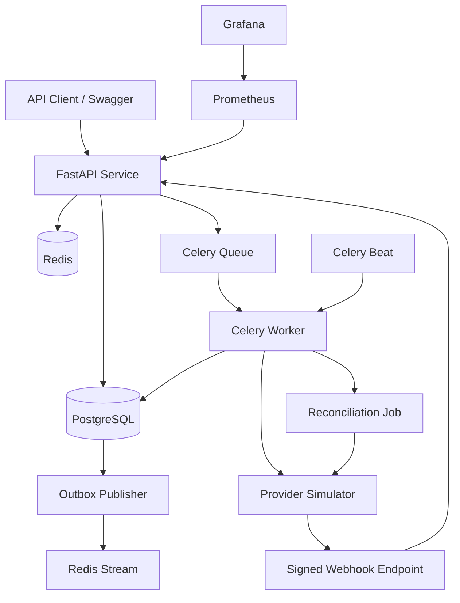
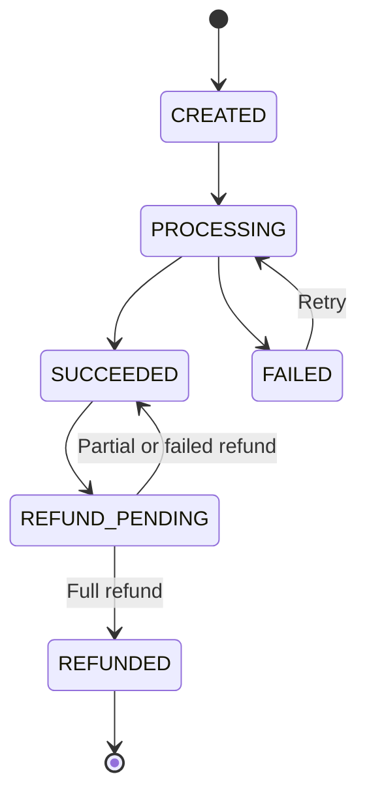
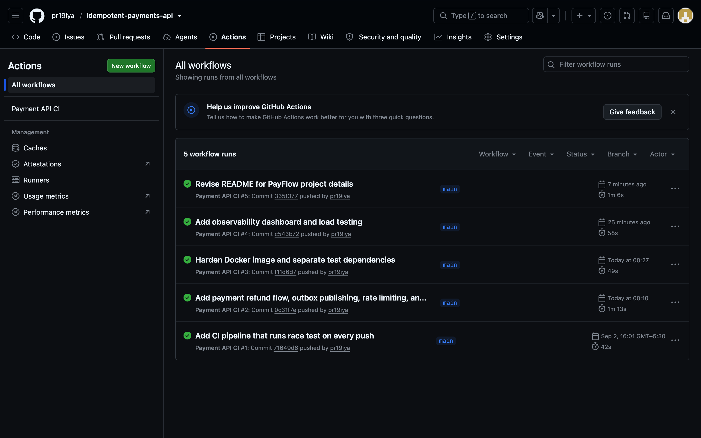

# PayFlow — Payment Gateway Backend

PayFlow is a backend payment-processing system built to explore the engineering problems behind a payment gateway rather than only implementing basic CRUD APIs.

The project handles asynchronous payment processing, idempotent requests, retries, signed provider webhooks, reconciliation, refunds, transactional outbox publishing, rate limiting, monitoring, and load testing.

It uses a provider simulator so that successful payments, declines, timeouts, duplicate webhooks, and lost webhooks can be tested without connecting to a real payment provider.

> This is a portfolio and learning project. It does not process real money or store card details.

- **Swagger API:**[Payflow API] https://payflow-api-wupu.onrender.com/docs#/Refunds/retrieve_refund_v1_refunds__refund_id__get
  
-  **Readiness Check:** [Service Health] https://payflow-api-wupu.onrender.com/health/ready

---

## Why I built this

A payment API may appear simple from the outside: accept an amount, contact a provider, and return a status. The difficult part is dealing with everything that can go wrong around that request.

For example:

- The client may submit the same payment more than once.
- The provider may time out after processing the payment.
- A webhook may be delivered twice.
- A successful webhook may never arrive.
- A worker may fail while changing payment state.
- A refund may exceed the original payment amount.
- A database update may succeed while event publication fails.

I built PayFlow to understand and implement solutions to these cases in one complete backend system.

---

## Features

### Payment processing

- Create and retrieve payments
- Asynchronous processing with Celery
- Explicit payment state transitions
- Provider success, decline, timeout, and server-error simulation
- Automatic retries with exponential backoff
- Permanent and transient provider-error handling
- Payment event history for auditability

### Reliability

- Idempotency keys for payment and refund creation
- Redis-based idempotency locking
- Duplicate-request replay
- HMAC-SHA256 webhook verification
- Duplicate-webhook protection
- Lost-webhook recovery through scheduled reconciliation
- Database row locking during state transitions
- Transactional outbox pattern for reliable event creation
- Redis Streams as the event destination

### Refunds

- Partial refunds
- Full refunds
- Asynchronous refund processing
- Refund idempotency
- Refund event history
- Prevention of refunds greater than the remaining refundable amount
- Payment transition to `REFUNDED` after a complete refund
- Payment restoration when refund processing fails

### Operations

- Liveness and readiness endpoints
- Database and Redis health checks
- Request IDs for tracing
- API rate limiting
- Structured application logging
- Prometheus metrics
- Provisioned Grafana dashboard
- Locust load tests
- Docker Compose development environment
- GitHub Actions continuous integration

---

## Architecture



### Component responsibilities

| Component | Responsibility |
|---|---|
| FastAPI | Validates requests and exposes payment, refund, webhook, health, and metrics endpoints |
| PostgreSQL | Stores payments, refunds, audit events, webhook records, and outbox events |
| Redis | Celery broker/backend, idempotency locks, rate limiting, and event streams |
| Celery worker | Processes payments, refunds, reconciliation, and outbox publishing |
| Celery Beat | Schedules reconciliation and outbox-publishing jobs |
| Provider simulator | Simulates payment-provider responses and webhook delivery |
| Prometheus | Collects HTTP and application metrics |
| Grafana | Displays operational and business metrics |
| Locust | Generates concurrent traffic for performance testing |

---

## Payment lifecycle

A payment moves only through permitted state transitions.



Every important transition is written to `payment_events`, providing an audit trail separate from the latest value stored in the `payments` table.

A normal successful payment produces events similar to:

```text
PAYMENT_CREATED
PAYMENT_PROCESSING
PAYMENT_SUCCEEDED
```

A payment completed through a delayed webhook produces:

```text
PAYMENT_CREATED
PAYMENT_PROCESSING
PAYMENT_AWAITING_WEBHOOK
PAYMENT_SUCCEEDED
```

---

## Handling failure cases

### Duplicate payment requests

The client provides an `Idempotency-Key` while creating a payment. Reusing the same key for the same merchant returns the original payment instead of creating another one.

Redis is used for short-lived coordination, while PostgreSQL provides the durable uniqueness guarantee.

### Temporary provider failures

Network errors, timeouts, and provider `5xx` responses are treated as transient failures. Celery retries these operations with exponential backoff.

After the retry limit is reached, the payment is moved to `FAILED` with a failure code such as:

```text
RETRIES_EXHAUSTED
```

### Duplicate webhooks

Each provider webhook contains a unique event ID. The event ID is stored with a uniqueness constraint before the payment is updated.

If the same webhook arrives again, it is acknowledged but does not create a second state transition or ledger event.

### Lost webhooks

A provider may successfully complete a payment even if its webhook never reaches the API.

The reconciliation job periodically finds older `PROCESSING` payments, requests their latest status from the provider, and corrects the local state when necessary.

A reconciled payment records an event such as:

```text
PAYMENT_RECONCILED_SUCCEEDED
```

### Transactional outbox

Payment and refund state changes also create an outbox record in the same database transaction.

A scheduled publisher reads pending outbox records and publishes them to a Redis Stream. It marks a record as published only after publication succeeds.

This prevents a state change from being committed without its corresponding event being recorded for later delivery.

---

## Technology stack

| Area | Technology |
|---|---|
| API | Python 3.13, FastAPI, Uvicorn |
| Validation | Pydantic |
| Database | PostgreSQL 15, Psycopg 3 |
| Cache and messaging | Redis 7 |
| Background processing | Celery |
| HTTP client | HTTPX |
| Monitoring | Prometheus, Grafana |
| Load testing | Locust |
| Automated testing | Pytest |
| Infrastructure | Docker, Docker Compose |
| CI | GitHub Actions |

---

## Project structure

```text
.
├── app/
│   ├── api/
│   │   ├── health.py
│   │   ├── metrics.py
│   │   ├── payments.py
│   │   ├── refunds.py
│   │   └── webhooks.py
│   ├── core/
│   │   ├── config.py
│   │   ├── logging.py
│   │   ├── metrics.py
│   │   ├── rate_limit.py
│   │   └── security.py
│   ├── schemas/
│   │   └── refunds.py
│   ├── services/
│   │   ├── idempotency.py
│   │   ├── outbox.py
│   │   ├── payment_service.py
│   │   ├── provider_client.py
│   │   ├── reconciliation.py
│   │   └── refund_service.py
│   ├── workers/
│   │   ├── celery_app.py
│   │   └── tasks.py
│   ├── db.py
│   ├── main.py
│   └── schema.sql
├── migrations/
│   └── 004_create_refunds.sql
├── monitoring/
│   ├── grafana/
│   │   ├── dashboards/
│   │   └── provisioning/
│   └── prometheus.yml
├── provider_simulator/
│   └── main.py
├── tests/
│   └── test_end_to_end.py
├── loadtest/
│   ├── results/
│   └── RESULTS.md
├── .github/workflows/
│   └── ci.yml
├── docker-compose.yml
├── Dockerfile
├── locustfile.py
├── pytest.ini
├── requirements.txt
└── requirements-dev.txt
```

---

## Running the project locally

### Prerequisites

Install:

- Docker Desktop
- Docker Compose
- Git

You do not need to install PostgreSQL or Redis separately when using Docker Compose.

### 1. Clone the repository

```bash
git clone <YOUR_GITHUB_REPOSITORY_URL>
cd <YOUR_REPOSITORY_FOLDER>
```

### 2. Create the environment file

Copy the example file:

```bash
cp .env.example .env
```

The local development values should include:

```env
APP_ENV=development

DATABASE_URL=postgresql://postgres:postgres@db:5432/payments
REDIS_URL=redis://redis:6379/0

CELERY_BROKER_URL=redis://redis:6379/1
CELERY_RESULT_BACKEND=redis://redis:6379/2

PROVIDER_URL=http://provider-simulator:8001
PROVIDER_API_KEY=provider-development-key

MERCHANT_API_KEY=merchant-development-key
WEBHOOK_SECRET=development-webhook-secret
PAYMENT_API_WEBHOOK_URL=http://api:8000/v1/webhooks/provider

IDEMPOTENCY_LOCK_SECONDS=30
IDEMPOTENCY_RESULT_SECONDS=86400

RATE_LIMIT_REQUESTS=100
RATE_LIMIT_WINDOW_SECONDS=60
```

These credentials are only development defaults. Use strong generated secrets in a deployed environment.

### 3. Start the services

```bash
docker compose up -d --build
```

### 4. Check container status

```bash
docker compose ps
```

The API, database, Redis, provider simulator, Celery worker, and Celery Beat services should all be running.

### 5. Apply the refund migration

For an existing local database:

```bash
docker compose exec -T db psql \
  -U postgres \
  -d payments \
  < migrations/004_create_refunds.sql
```

### 6. Check readiness

```bash
curl http://localhost:8000/health/ready
```

Expected response:

```json
{
  "status": "ready",
  "checks": {
    "database": true,
    "redis": true
  }
}
```

---

## Local URLs

| Service | URL |
|---|---|
| API documentation | [http://localhost:8000/docs](http://localhost:8000/docs) |
| API readiness | [http://localhost:8000/health/ready](http://localhost:8000/health/ready) |
| API metrics | [http://localhost:8000/metrics](http://localhost:8000/metrics) |
| Provider simulator | [http://localhost:8001/docs](http://localhost:8001/docs) |
| Prometheus | [http://localhost:9090](http://localhost:9090) |
| Grafana | [http://localhost:3000](http://localhost:3000) |

---

## API usage

All merchant endpoints require:

```text
X-API-Key: merchant-development-key
```

### Create a payment

```bash
curl -X POST http://localhost:8000/v1/payments \
  -H "Content-Type: application/json" \
  -H "X-API-Key: merchant-development-key" \
  -H "Idempotency-Key: payment-example-001" \
  -H "X-Test-Scenario: success" \
  -d '{
    "user_id": "user-101",
    "amount_cents": 100000,
    "currency": "INR"
  }'
```

Example response:

```json
{
  "id": "f11e572a-79df-4512-9c1e-a059f34f927a",
  "merchant_id": "demo-merchant",
  "idempotency_key": "payment-example-001",
  "user_id": "user-101",
  "amount_cents": 100000,
  "currency": "INR",
  "status": "CREATED",
  "provider_payment_id": null,
  "retry_count": 0,
  "duplicate": false
}
```

Processing happens asynchronously, so the initial response may contain `CREATED`.

### Retrieve a payment

```bash
curl \
  -H "X-API-Key: merchant-development-key" \
  http://localhost:8000/v1/payments/<PAYMENT_ID>
```

### Retrieve payment events

```bash
curl \
  -H "X-API-Key: merchant-development-key" \
  http://localhost:8000/v1/payments/<PAYMENT_ID>/events
```

### Create a partial refund

The payment must be successful before it can be refunded.

```bash
curl -X POST \
  http://localhost:8000/v1/payments/<PAYMENT_ID>/refunds \
  -H "Content-Type: application/json" \
  -H "X-API-Key: merchant-development-key" \
  -H "Idempotency-Key: refund-example-001" \
  -H "X-Test-Scenario: success" \
  -d '{
    "amount_cents": 40000
  }'
```

### Retrieve a refund

Use the refund ID returned by the refund-creation request:

```bash
curl \
  -H "X-API-Key: merchant-development-key" \
  http://localhost:8000/v1/refunds/<REFUND_ID>
```

### Retrieve refund events

```bash
curl \
  -H "X-API-Key: merchant-development-key" \
  http://localhost:8000/v1/refunds/<REFUND_ID>/events
```

---

## Provider test scenarios

The `X-Test-Scenario` header controls the provider simulator.

| Scenario | Behaviour |
|---|---|
| `success` | Provider completes the operation successfully |
| `declined` | Provider returns a permanent decline |
| `timeout` | Provider response exceeds the client timeout |
| `server_error` | Provider returns a temporary server error |
| `delayed_success` | Provider returns success after a delay |
| `delayed_webhook` | Initial result is processing; final success arrives by webhook |
| `duplicate_webhook` | The same signed webhook is delivered twice |
| `lost_webhook` | Provider succeeds without delivering the webhook |

These scenarios make failure-handling behaviour repeatable during development and testing.

---

## Automated tests

The end-to-end suite tests the running Docker Compose system rather than mocking every internal dependency.

Coverage includes:

- Successful payment and partial-refund flow
- Declined payment
- Duplicate-webhook processing
- Lost-webhook reconciliation
- Full refund
- Excessive-refund rejection

Start the services before running the tests:

```bash
docker compose up -d
```

Then run:

```bash
pytest -v -s tests/test_end_to_end.py
```

Expected result:

```text
6 passed
```

The test suite intentionally creates new idempotency keys for every run so that previous records do not affect later test executions.

---

## Monitoring

Prometheus scrapes metrics exposed by the API. Grafana is automatically provisioned with the PayFlow dashboard.

The dashboard includes:

- Payment success rate
- Failed payment count
- Successful refund volume
- API p95 latency
- API request rate
- Payments grouped by status
- Refunds grouped by status
- Payment and refund retries
- Outbox event count

If a request-rate or latency graph is initially empty, generate API traffic and wait for several Prometheus scrape intervals.

For example:

```bash
for i in {1..20}; do
  curl -s \
    -H "X-API-Key: merchant-development-key" \
    http://localhost:8000/v1/payments/00000000-0000-0000-0000-000000000000 \
    > /dev/null
  sleep 1
done
```

---

## Load testing

Locust is used to exercise payment creation, retrieval, and event-history endpoints concurrently.

Run a 25-user test:

```bash
python -m locust \
  -f locustfile.py \
  --headless \
  --users 25 \
  --spawn-rate 5 \
  --run-time 60s \
  --host http://localhost:8000 \
  --csv loadtest/results/users25
```

### Local results

The following measurements were collected on a local development machine using the Docker Compose environment.

| Metric | Result |
|---|---:|
| Concurrent users | 25 |
| Duration | 60 seconds |
| Total requests | 2,355 |
| Failed requests | 0 |
| Failure rate | 0% |
| Throughput | 39.82 requests/second |
| Average response time | 8.87 ms |
| Median response time | 7 ms |
| p95 response time | 17 ms |
| p99 response time | 52 ms |
| Maximum response time | 244 ms |
| Celery queue after the test | 0 |
| Readiness after the test | Healthy |

The results indicate that the local system handled the test without HTTP failures or a remaining Celery backlog.

These numbers describe one local test environment and should not be treated as production capacity guarantees.

Detailed results are available in [`loadtest/RESULTS.md`](loadtest/RESULTS.md).

---

## Working demonstration

### Swagger API

The Swagger interface can be used to create payments, inspect their status, review event history, and initiate refunds.


### Automated test suite


### Continuous integration

GitHub Actions runs the automated tests on pushes and pull requests.



---

## Security decisions

This project includes several security-related controls:

- Merchant endpoints require an API key.
- Webhook signatures use HMAC-SHA256.
- Signature comparison uses constant-time comparison.
- Webhook state updates occur only after successful verification.
- Duplicate provider event IDs are rejected safely.
- Payment and refund input is validated by Pydantic.
- Rate limiting reduces repeated API abuse.
- Containers run as a non-root application user.
- Secrets are loaded through environment variables.
- `.env` files are excluded from version control.
- The application does not collect card numbers, CVVs, or other payment credentials.

A production payment platform would additionally require secret rotation, a dedicated identity system, TLS enforcement, network isolation, encryption policies, PCI-DSS controls, and integration with an approved payment processor.

---

## Important design decisions

### Why asynchronous processing?

Provider calls can be slow or temporarily unavailable. Moving these calls to Celery keeps the API request short and allows retries to happen outside the web process.

### Why both Redis and PostgreSQL for idempotency?

Redis provides fast locking between concurrent requests. PostgreSQL stores the payment record and provides the final durable uniqueness constraint.

Redis alone would not be sufficient because its keys may expire or be lost.

### Why maintain event tables?

The `status` column shows only the current result. Event tables preserve how the system reached that result, which is useful for debugging, reconciliation, and audits.

### Why use a transactional outbox?

Publishing an event directly after committing a payment change creates a failure window: the database update may succeed while event publication fails.

Writing the outbox event in the same transaction removes this gap. Publication can safely be retried later.

### Why build a provider simulator?

Connecting a portfolio project to a real provider would make uncommon failure cases difficult to reproduce. The simulator makes timeout, decline, duplicate-webhook, and lost-webhook scenarios deterministic.

---

## Current limitations

This project deliberately focuses on backend reliability rather than real financial processing.

Current limitations include:

- The provider is simulated.
- No real card or bank information is accepted.
- Merchant authentication uses one configured API key.
- The simulator stores some provider state in memory.
- Redis Streams are used as a demonstration event destination.
- Database migrations are currently SQL-based rather than managed by Alembic.
- Load-test results are from a local environment.
- There is no merchant-facing frontend.

These would be natural areas to improve if the project were developed into a real product.

---

## Possible future improvements

- Replace the shared merchant key with database-backed merchant accounts
- Add OAuth or scoped API credentials
- Move SQL migrations to Alembic
- Add OpenTelemetry distributed tracing
- Add alert rules for high failure rate and queue backlog
- Add dead-letter handling for permanently failed outbox events
- Persist provider simulator state in its own database
- Add payment cancellation
- Add webhook delivery retries for merchant notifications
- Add multi-currency settlement rules
- Add Kubernetes manifests and horizontal worker scaling
- Add contract tests between the API and provider adapter

---

## Continuous integration

The GitHub Actions workflow verifies the project automatically on every push and pull request.

The pipeline starts the required services and runs the end-to-end test suite. A green workflow confirms that payment creation, background processing, webhooks, reconciliation, refunds, and validation work together.

Workflow file:

```text
.github/workflows/ci.yml
```

---

## Useful commands

Start all services:

```bash
docker compose up -d --build
```

View running services:

```bash
docker compose ps
```

Follow API logs:

```bash
docker compose logs -f api
```

Follow worker logs:

```bash
docker compose logs -f celery-worker
```

Follow scheduler logs:

```bash
docker compose logs -f celery-beat
```

Inspect registered Celery tasks:

```bash
docker compose exec celery-worker \
  celery -A app.workers.celery_app.celery_app inspect registered
```

Check the Celery queue:

```bash
docker compose exec redis redis-cli LLEN celery
```

Stop the environment:

```bash
docker compose down
```

Stop the environment and delete local database/Redis volumes:

```bash
docker compose down -v
```

The final command permanently deletes local container data.

---

## Project status

- ✅ Core payment workflow
- ✅ Payment idempotency
- ✅ Provider retries and exponential backoff
- ✅ Signed asynchronous webhooks
- ✅ Duplicate-webhook protection
- ✅ Lost-webhook reconciliation
- ✅ Partial and full refunds
- ✅ Refund validation and idempotency
- ✅ Transactional outbox
- ✅ Redis Stream publishing
- ✅ Rate limiting and health checks
- ✅ Prometheus and Grafana monitoring
- ✅ End-to-end automated tests
- ✅ Locust performance tests
- ✅ GitHub Actions CI
-✅ Public deployment available

---


This project is available for educational and portfolio purposes. Add an open-source license before allowing redistribution or commercial use.
